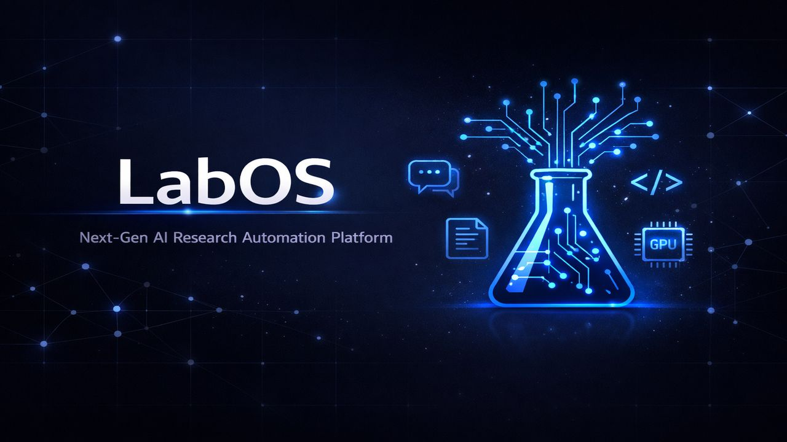

<div align="center">



# LabOS

**Next-Gen AI Research Automation Platform**

Full research lifecycle coverage: Ideation · Literature Survey · Hypothesis Design · Experiment Execution · Paper Writing

Local-first · Multi-model · Fully open-source

[](./LICENSE)
[](https://python.org)
[](https://fastapi.tiangolo.com)
[](https://sqlite.org)
[](./CONTRIBUTING.md)

[中文](./README.md) · [Quick Start](#quick-start) · [Screenshots](#screenshots) · [Contributing](./CONTRIBUTING.md) · [Roadmap](https://github.com/YUANXICHE98/LabOS/issues)

</div>

---

> **✦ Core Capabilities**
>
> **Research Pipeline** · 4-stage automation &nbsp;│&nbsp; **AI Chat** · Multi-model streaming &nbsp;│&nbsp; **Experiment Execution** · SSH to remote GPU servers &nbsp;│&nbsp; **Codex Integration** · AI writes experiment code
>
> **Memory System** · Cross-experiment knowledge persistence &nbsp;│&nbsp; **Multi-model Config** · Separate profiles for chat / code / paper / experiment &nbsp;│&nbsp; **Stage Reports** · Survey → Analysis → Experiment &nbsp;│&nbsp; **Local-first** · Your data stays with you

---

## Demo Video

<div align="center">

[🎬 **Watch LabOS Demo (4min, Chinese with UI walkthrough)**](https://github.com/YUANXICHE98/LabOS/releases/download/v3.4.1/labos-demo-zh.mp4)

> Also available on the [Releases page](https://github.com/YUANXICHE98/LabOS/releases/tag/v3.4.1)

</div>

## Screenshots

<details open>
<summary><strong>📊 Dashboard</strong> — Project overview, quick navigation to chat, projects, or new experiments</summary>
<br>
<div align="center">

</div>
</details>

<details open>
<summary><strong>📁 Projects</strong> — Multi-project management with independent experiments, memory, and paper library per project</summary>
<br>
<div align="center">

</div>
</details>

<details open>
<summary><strong>🧪 Experiment Pipeline</strong> — 4-stage pipeline status, stage approvals, real-time logs</summary>
<br>
<div align="center">

</div>
</details>

## Features

| Feature | Description |
|:--------|:------------|
| 🔬 **4-Stage Research Pipeline** | Ideation → Design → Execution → Paper, each stage produces independent reports |
| 💬 **Chat-Driven** | AI assistant with streaming; create projects directly from conversations |
| 🤖 **Multi-LLM Profiles** | Configure different models and APIs for chat, code analysis, paper writing, experiment design |
| 🖥️ **Remote Execution** | SSH to GPU servers (AutoDL, etc.) with real-time log streaming |
| ⚡ **Codex CLI Integration** | Full-auto mode, JSONL streaming, AI writes experiment code |
| 🧠 **Memory System** | Cross-experiment knowledge persistence, project-level memory retrieval |
| ✅ **Stage Approval** | Approve → next stage / Revise & rerun / Reject & terminate |
| ⚙️ **Fully Configurable** | All settings exposed via Web UI; works with any OpenAI-compatible API |
| 💾 **Local-First** | SQLite storage, all data stays on your machine |

## Quick Start

```bash
git clone https://github.com/YUANXICHE98/LabOS.git
cd LabOS
bash start.sh
```

Or manually:

```bash
pip install -r requirements.txt
cd src && python api_server.py
```

Open your browser at `http://localhost:8000`

### First-Time Setup

1. Go to **Settings** → Configure your LLM API endpoint and key (any OpenAI-compatible API)
2. (Optional) Configure SSH server for remote experiment execution
3. Go to **Chat** → Start chatting → Create a project from the conversation
4. Or go to **Projects** → Create a project manually → Launch an experiment

### Multi-LLM Configuration

LabOS supports independent LLM configurations per task type:

| Task Type | Use Case | Recommended Models |
|:----------|:---------|:-------------------|
| General Chat | Daily research discussions | DeepSeek-Chat / GPT-4o |
| Code Analysis | Code review, experiment code generation | DeepSeek-Coder / Claude |
| Paper Analysis | Literature review, paper writing | GPT-4o / Claude |
| Experiment Design | Hypothesis generation, experiment planning | DeepSeek-Chat / Claude |

Configure via **Settings > LLM Profiles** — each task type gets its own Base URL + API Key + Model.

## Project Structure

```
LabOS/
├── src/
│   ├── api_server.py      # FastAPI backend — all API endpoints and pipeline logic
│   ├── index.html          # Main page (SPA)
│   ├── app.js              # Frontend — UI logic, API calls, SSE streaming
│   └── style.css           # Styles
├── docs/
│   ├── screenshots/        # Screenshots
│   └── videos/             # Demo videos
├── start.sh                # One-click launcher
├── requirements.txt        # Python dependencies
├── CONTRIBUTING.md         # Contribution guide
├── GOVERNANCE.md           # Contributor governance & incentives
└── LICENSE                 # AGPL-3.0
```

## Tech Stack

| Layer | Technology |
|:------|:-----------|
| Backend | Python / FastAPI / uvicorn |
| Database | SQLite (zero-config, local file) |
| Frontend | Vanilla HTML + CSS + JavaScript (no build step) |
| Remote Execution | Paramiko (SSH) |
| LLM Calls | httpx (OpenAI-compatible protocol) |
| Real-time | Server-Sent Events (SSE) |

## Open Core Model

LabOS follows an **open core + paid add-ons** model:

### 🆓 Free & Open Source (this repo)
All code in this repo is permanently free and open source: full research pipeline, chat, project management, LLM config, memory system, experiment execution.

### 💎 Paid Add-ons (coming soon)
- **Skill Library** — Verified research methodologies, experiment paths, and best practices. Think of it as a knowledge base of "what actually works"
- **Premium Integrations** — Pre-built connectors for more cloud GPU platforms and HPC clusters
- **Priority Support** — Direct access to the dev team

> The platform itself will always be open source. The real value is in **verified research methodologies** — battle-tested paths that save weeks of trial and error.

## Contributor Incentives

We value every contribution. See **[GOVERNANCE.md](./GOVERNANCE.md)** for details.

| Tier | Requirement | Incentive |
|:-----|:------------|:----------|
| 🌱 Contributor | 1 merged PR | Contributors Wall recognition |
| 🌿 Active Contributor | 3+ PRs | Free Skill Library access + Beta early access |
| 🌳 Core Contributor | 10+ PRs or 1 major feature | **30% revenue share** + paper co-authorship |
| 💰 Bounty Tasks | `💰 bounty` label | Crypto / Sponsors cash rewards |

Code isn't the only way to contribute — docs, translations, bug reports, research methodologies, and design all count equally.

PRs welcome! See [CONTRIBUTING.md](./CONTRIBUTING.md), browse [Issues](https://github.com/YUANXICHE98/LabOS/issues) to find tasks that interest you.

## Support the Project

<div align="center">

⭐ **Star this repo** — Help more people discover LabOS &nbsp;│&nbsp; 🍴 **Fork & Contribute** &nbsp;│&nbsp; 💰 **Sponsor** — Fund continued development

</div>

### Cryptocurrency

| Chain | Address |
|:------|:--------|
| **ETH / ERC-20** (USDT, USDC, etc.) | `0xc6B4720835E6C3CB58618B4df26B64F595C30202` |

### Alipay

<div align="center">

</div>

### GitHub Sponsors

Click the **"Sponsor"** button at the top of this repository.

---

<div align="center">

## Contributors

<a href="https://github.com/YUANXICHE98/LabOS/graphs/contributors">
  
</a>

---

**[AGPL-3.0](./LICENSE)** — Modifications must be open-sourced. Network services must provide source code. Derivatives must reference the upstream repo.

Made with ❤️ for the research community

</div>
